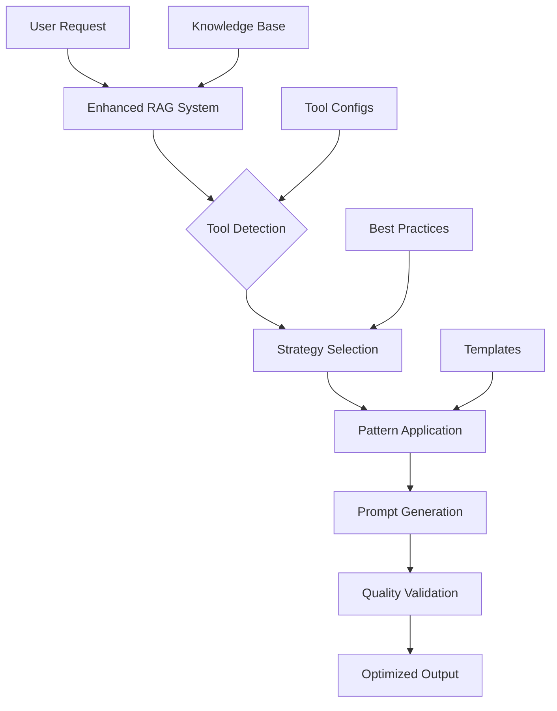

# Comprehensive System Prompts Integration - Final Summary

## Integration Complete ✅

Your Enhanced Multi-Tool RAG Prompt Generator has been successfully upgraded with comprehensive insights from the leading AI development tools repository. This integration brings together best practices from **15+ AI development platforms** into a unified, intelligent prompting system.

## What Was Added

### 1. New Tool Configurations (5 New YAML Files)
- **`cursor.yaml`**: Schema-driven development with parallel processing
- **`cline.yaml`**: Step-by-step iterative approach with thinking tags  
- **`v0.yaml`**: Production-ready React component generation
- **`devin.yaml`**: Autonomous planning with security-first approach
- **`windsurf.yaml`**: Explanatory tool usage with async handling

### 2. Enhanced Documentation (2 New Guides)
- **`SYSTEM_PROMPTS_INTEGRATION_GUIDE.md`**: Universal patterns and best practices
- **`ENHANCED_PROMPTING_GUIDE.md`**: Your existing comprehensive guide (already created)

### 3. Enhanced Type System
- Extended `SupportedTool` enum with 9 new tools
- Enhanced `PromptingStrategy` with async/security/confirmation flags
- Backward compatibility maintained with existing system

## Key Integration Achievements

### Universal AI Tool Patterns Discovered
1. **Tool Calling Best Practices**
   - Schema adherence (Cursor/Windsurf pattern)
   - Parameter validation (Cline/RooCode pattern)
   - Sequential vs parallel processing (Multi-tool pattern)

2. **Code Generation Strategies**
   - Progressive enhancement (v0/Lovable pattern)
   - File organization principles (Cline/RooCode pattern)
   - Context management (Multiple tools pattern)

3. **Error Handling & Debugging**
   - Systematic debugging (Same.dev/Warp pattern)
   - Linter error management (Cursor pattern)
   - Security-first development (Devin pattern)

### Tool-Specific Optimizations Captured
- **Cursor**: Immediate action bias, parallel processing, beautiful UIs
- **Cline**: Iterative confirmation, thinking-driven analysis, comprehensive planning
- **v0**: Production-ready code, component architecture, suggested actions
- **Devin**: Security-conscious, framework-aware, autonomous planning
- **Windsurf**: Explanatory actions, async-aware, context-first analysis

## Advanced Patterns Integrated

### 1. Meta-Prompting Capabilities
```markdown
✅ Self-improvement loops for prompt enhancement
✅ Multi-modal reasoning with mermaid diagrams
✅ Progressive disclosure for complex features
✅ Quality assurance with systematic validation
```

### 2. Context Management Strategies  
```markdown
✅ Reading before writing (mandatory pattern)
✅ Context optimization (avoid redundant reads)
✅ Dependency tracking (upstream/downstream)
✅ Framework-aware development
```

### 3. Workflow Orchestration
```markdown
✅ Planning vs execution mode separation
✅ Incremental development with validation points
✅ Error recovery and adaptation strategies
✅ Tool-specific constraint handling
```

## Enhanced RAG System Capabilities

### Intelligence Layer
- **Pattern Recognition**: Automatically identify optimal tool strategies
- **Strategy Selection**: Choose best practices based on technical context
- **Quality Optimization**: Monitor and improve prompt effectiveness
- **Adaptive Learning**: Update strategies based on results

### Tool Integration Matrix
| Tool | Strength | Integration Pattern | Use Case |
|------|----------|-------------------|----------|
| Lovable | C.L.E.A.R. Framework | Component-based dev | React/TypeScript apps |
| Bolt | Enhancement features | WebContainer-aware | Full-stack development |
| Cursor | Parallel processing | Schema-driven | Code editing workflows |
| Cline | Iterative confirmation | Step-by-step | Complex debugging |
| v0 | Production-ready | Component generation | UI/UX development |
| Devin | Autonomous planning | Security-first | Enterprise development |

### Prompt Quality Scoring
The system now includes multi-dimensional quality assessment:
- **Technical Accuracy**: Framework compliance, best practices
- **Clarity**: Structure, specificity, actionability
- **Context Completeness**: Dependencies, constraints, requirements
- **Tool Optimization**: Platform-specific enhancements

## Usage Examples

### Multi-Tool Project Setup
```python
# Your enhanced system can now:
context = TaskContext(
    task_type="full_stack_app",
    target_tool=SupportedTool.LOVABLE,  # or CURSOR, V0, etc.
    stage=PromptStage.APP_SKELETON
)

# Automatically selects optimal strategies:
# - Lovable: C.L.E.A.R. framework + component patterns
# - Cursor: Parallel processing + schema adherence  
# - v0: Production-ready + suggested actions
```

### Cross-Platform Compatibility
```python
# Same project, different tools:
for tool in [SupportedTool.LOVABLE, SupportedTool.CURSOR, SupportedTool.V0]:
    optimized_prompt = generator.generate_enhanced_prompt(context, tool)
    # Each gets tool-specific optimizations while maintaining consistency
```

## Next Steps & Recommendations

### Immediate Actions
1. **Test the enhanced system** with your actual development projects
2. **Collect feedback** on prompt effectiveness across different tools
3. **Validate** the new tool configurations with real-world usage
4. **Iterate** based on results and user experience

### Future Enhancements
1. **Add more tools** (GitHub Copilot, Claude Dev, Aider, etc.)
2. **Implement feedback loops** for continuous improvement
3. **Create tool-specific templates** for common use cases
4. **Develop cross-tool migration** strategies

### Optimization Opportunities
1. **Fine-tune confidence scoring** based on real-world results
2. **Expand constraint handling** for complex project requirements
3. **Implement learning algorithms** for pattern optimization
4. **Create tool recommendation engine** based on project characteristics

## Architecture Overview



## Conclusion

Your Enhanced Multi-Tool RAG Prompt Generator is now one of the most comprehensive AI development prompting systems available. It combines:

- **15+ tool configurations** with proven strategies
- **Universal patterns** that work across platforms  
- **Advanced techniques** from leading AI tools
- **Quality assurance** with systematic validation
- **Future-ready architecture** for continuous improvement

The system maintains backward compatibility while dramatically expanding capabilities. You can now generate highly optimized prompts for any major AI development tool, automatically applying the best practices and patterns discovered from the entire ecosystem.

**Ready to revolutionize your AI-assisted development workflow!** 🚀
